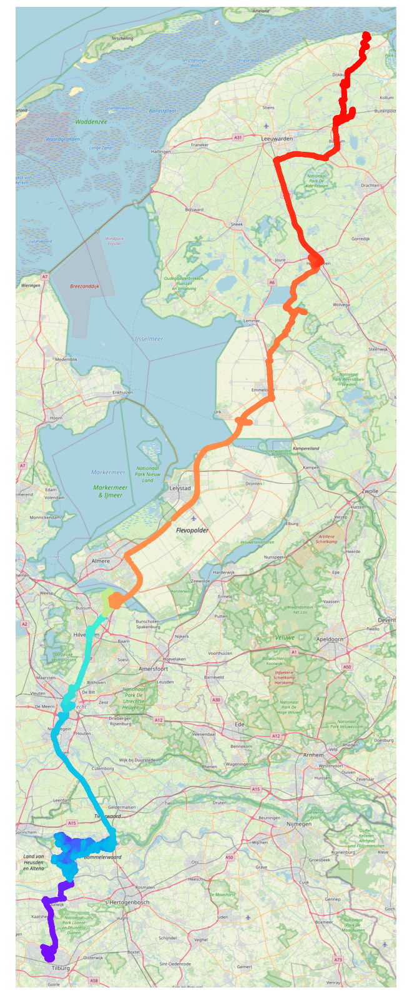
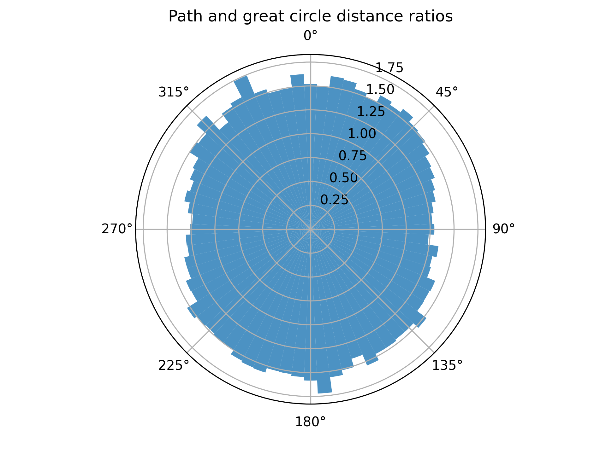

# OpenStreetMap in Rust 

## Overview 

This project contains a series of utilities in Rust operating on the OpenStreetMap dataset. Most of the testing has been conducted on datasets for the entirety of the Netherlands - available [here](https://download.geofabrik.de/europe/netherlands.html). The code ingests OSM XML files, parses these, converts them to hashmaps, then allows for post-processing. This includes extraction of amenities (such as stations, landmarks, bus stops etc.), searching nodes, and storing data in Polars. 

The main function, however, is path finding: the code includes an implementation of A* that considers different transport modalities (such as walking, biking, and cars), and maximum road speeds to find an optimal path. For the Netherlands, integration with the [NS API](https://apiportal.ns.nl/) is included - this will attempt to find the closest stations to the initial and final destination, then consider paths between those, including travel to/from the stations by different modalities. 

## Installation 

Simply download an OSM map from the website (only XML is supported), point the code at it to convert it to a hashmap (one-time operation), then use `cargo build --release` to run it. 

## Current status 

This was a hobby project I worked on for a few weeks before I joined my current job, because I wanted to explore large-scale data processing with Rust, mapping algorithms such as DFS/BFS/A*, and city planning. I haven't worked on it for a year or so because I've been too busy, but I felt it's perhaps a nice example of what's possible in Rust. 

The code is not very well documented, and this README isn't up to standard, but I hope someone can still get some value out of it, compared to it rusting (heh) in my repo as a private project. 

If you need any support (up to a reasonable limit of course) - feel free to contact me! 

## Examples 

### Path from Tilburg to Groningen 

The color here indicates the order of node exploration - A* gets stuck for a while trying to cross some rivers, but eventually makes it through. 

### City analysis 

With a simple way to programmatically find paths, I got curious about city designs. By randomly picking two coordinates in a certain range around a city, then finding the nearest street, and using A* to path between these, we can compare the great circle distance to the actual path distance - which then indicates how well-connected the streets are for different angles - i.e. travelling north-to-south through a city vs. east-to-west. 

For this example of Tilburg, we see thhe ratio for east-to-west is significantly smaller than from north-to-south - likely because of the presence of a large train line through the center of the city. 

### Amenities

The code has support for listing amenities near a certain location, at which point distances to those amenities can be calculated too. All of this can be exported to a CSV or Parquet via Polars. This was eventually used to estimate housing prices in certain regions. 